# 최종 발표자료 요약: 1등 + 2등 전문가 앙상블까지의 실험 흐름

작성일: 2026-07-02

## 1. 최종 결론

최종적으로 가장 좋은 제출은 다음 조합이었다.

```text
final = 0.50 * GOH30_ODE_heavy + 0.50 * second_final
```

이를 내부 전문가까지 풀면 다음과 같다.

```text
GOH30_ODE_heavy = 0.20 * 1등 GRU + 0.60 * 1등 ODE/RK + 0.20 * 1등 H
second_final    = 0.60 * 2등 base + 0.40 * 2등 phys

final =
0.10 * 1등 GRU
+ 0.30 * 1등 ODE/RK
+ 0.10 * 1등 H
+ 0.30 * 2등 base
+ 0.20 * 2등 phys
```

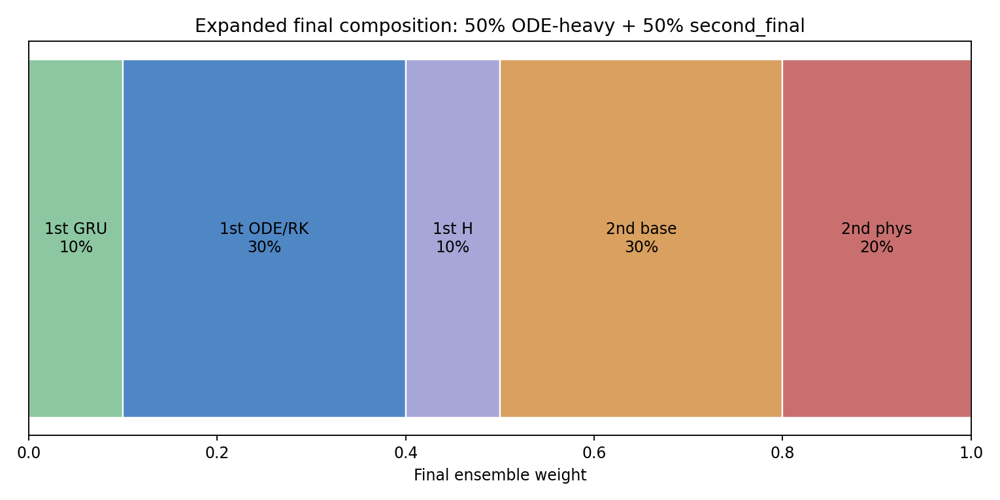

핵심 해석:

- 1등 계열은 최근 움직임 변화에 민감한 동역학 중심 전문가다.
- 2등 base는 불안정한 궤적을 더 보수적으로 smoothing하는 전문가다.
- 2등 phys는 회전물리 기반으로 1등 ODE-heavy와 다른 방향의 보정을 제공한다.
- 단순히 모델 수를 늘린 것이 아니라, 서로 다른 오류를 내는 전문가를 섞었기 때문에 점수가 올랐다.

## 1-1. 최종 expert별 특징

최종 비율은 단순히 점수가 좋았던 파일 두 개를 평균낸 것이 아니라, 성향이 다른 5개 expert를 다음 비율로 배치한 구조로 볼 수 있다.

| 최종 expert | 최종 비율 | 원래 소속 | 역할 | 비율 의미 |
| --- | ---: | --- | --- | --- |
| 1등 GRU | 10% | GOH30 | 시퀀스 패턴, 데이터 기반 보정 | ODE 중심 예측이 과하게 물리식에 치우치지 않게 보조 |
| 1등 ODE/RK | 30% | GOH30 | 최근 속도/가속/회전 변화를 반영하는 동역학 expert | 1등 내부에서 private이 가장 좋았던 핵심 축 |
| 1등 H | 10% | GOH30 | 물리 prior 기반 보조 expert | GRU/ODE와 다른 물리 신호를 약하게 유지 |
| 2등 base | 30% | 2등 코드 | 보수적 smoothing, z 안정화 | 급회전/고노이즈에서 덜 꺾는 안정화 축 |
| 2등 phys | 20% | 2등 코드 | 회전물리 기반 보정, ODE-heavy와 낮은 상관 | 최종 개선에서 중요했던 diversity 축 |

따라서 최종 모델의 성격은 다음처럼 볼 수 있다.

```text
동역학 추종 40% = 1등 ODE/RK 30% + 1등 H 일부
데이터 기반 보정 10% = 1등 GRU
보수적 smoothing 30% = 2등 base
회전물리 diversity 20% = 2등 phys
```

발표에서는 “1등 50% + 2등 50%”보다 다음 문장이 더 정확하다.

> 최근 운동 변화를 강하게 따라가는 1등 동역학 계열과, 불안정한 궤적을 보수적으로 누르는 2등 base, 그리고 1등과 다른 방향의 회전물리 expert를 균형 있게 섞은 구조다.

## 2. 점수 흐름

| 제출 | Public | Private | 해석 |
| --- | ---: | ---: | --- |
| GOH30 원본 | 0.7020 | 0.7025 | 1등 원본 코드 재현 |
| GOH30 ODE-heavy | 0.7018 | 0.7033 | 1등 내부에서 ODE/RK 비중 강화 |
| ODE-heavy + 2등 20% | 0.7034 | 0.7042 | 처음으로 외부 expert 효과 확인 |
| ODE-heavy + 2등 40% | 0.7032 | 0.7045 | private 개선, public 정체 |
| ODE-heavy + 2등 50% | 0.7052 | 0.7053 | 최종 최고 |
| ODE-heavy + 2등 60% | 0.7044 | 0.7049 | second 쪽으로 과하게 이동 |
| ODE 50% + base 35% + phys 15% | 0.7034 | 0.7039 | 2등 phys 비중을 줄이면 성능 하락 |

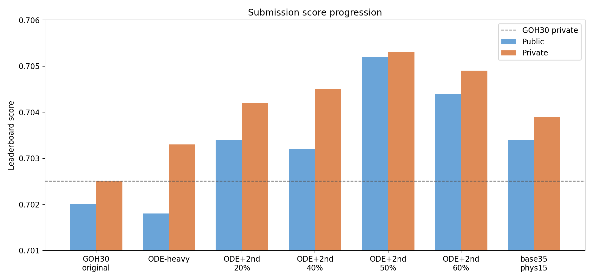

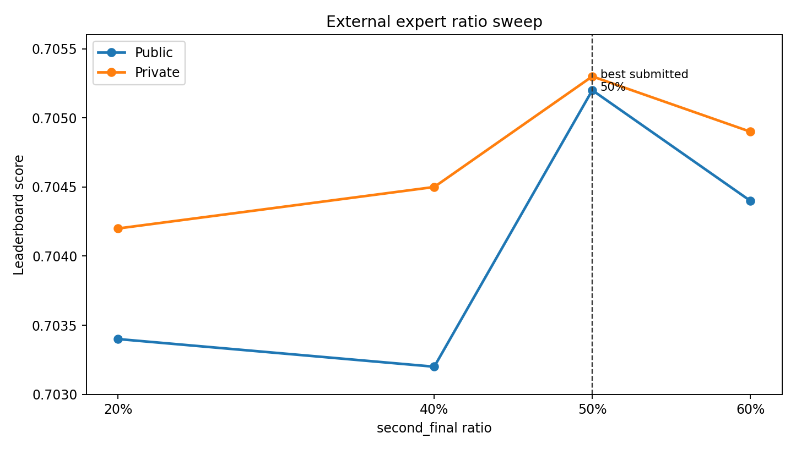

결론:

- 20% blend는 개선 신호를 보여줬다.
- 40%는 private이 더 좋아졌지만 public은 크게 오르지 않았다.
- 50%에서 public/private가 동시에 최고가 됐다.
- 60%는 50%보다 나빠져, 2등 쪽 보정이 과해지는 구간으로 보인다.

## 3. 1등 내부 비율을 왜 ODE-heavy로 선택했나

1등 GOH30 원본은 대략 다음 구조다.

```text
GOH30 original = GRU 33.3% + ODE/RK 33.3% + H 33.3%
```

우리가 선택한 1등 계열은 원본 등가중이 아니라 ODE-heavy다.

```text
GOH30_ODE_heavy = GRU 20% + ODE/RK 60% + H 20%
```

이 비율을 선택한 이유:

| 후보 | Public | Private |
| --- | ---: | ---: |
| GOH30 원본 | 0.7020 | 0.7025 |
| ODE-heavy | 0.7018 | 0.7033 |

해석:

- public은 거의 같거나 약간 낮았지만 private은 `+0.0008` 개선됐다.
- 최종 순위 기준으로는 private 성능이 더 중요하므로, 1등 계열 대표로 ODE-heavy를 선택하는 것이 타당했다.
- ODE/RK는 최근 속도, 가속, 회전 변화에 더 강하게 반응하는 동역학 전문가다.
- GRU와 H를 20%씩 남긴 이유는 ODE 단독 편향을 줄이고, sequence 패턴과 물리 prior를 보조로 유지하기 위해서다.

즉 1등 내부 비율의 의미는 다음과 같다.

```text
GRU 20%    : 데이터 기반 sequence 패턴 유지
ODE/RK 60%: private에서 강했던 동역학 expert를 중심으로 강화
H 20%      : 물리 기반 보조 expert로 ODE 편향 완화
```

## 4. 2등 내부 비율을 왜 유지했나

2등 코드는 복원 결과 다음 구조였다.

```text
second_final = 0.60 * second_base + 0.40 * second_phys
```

각 구성요소의 역할은 다음과 같이 분석됐다.

| 구성요소 | 전체 회전각 변화 | z 이동 변화 | ODE-heavy 보정과 평균 cos | 해석 |
| --- | ---: | ---: | ---: | --- |
| second_base | -0.949도 | -0.000060 | -0.139 | 덜 꺾고 z를 안정화하는 보수적 expert |
| second_phys | +0.240도 | -0.000033 | -0.357 | ODE-heavy와 가장 다른 방향의 회전물리 expert |
| second_final | -0.573도 | -0.000070 | -0.239 | base 안정성과 phys 다양성을 섞은 최종 expert |

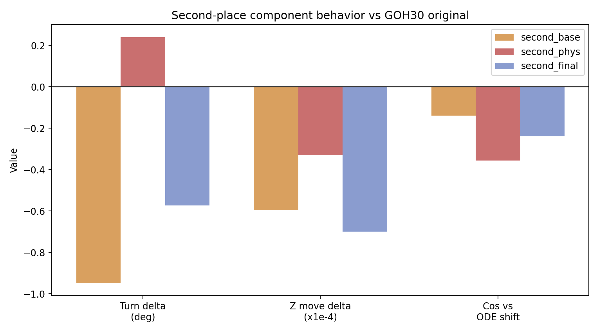

2등 내부 비율을 바꿔본 결과도 중요하다.

```text
기존 fixed_050:
0.50 * ODE-heavy + 0.30 * second_base + 0.20 * second_phys
=> 0.7052 / 0.7053

변경안:
0.50 * ODE-heavy + 0.35 * second_base + 0.15 * second_phys
=> 0.7034 / 0.7039
```

해석:

- second_base를 늘리고 second_phys를 줄였더니 점수가 크게 떨어졌다.
- 따라서 2등 내부의 `base 60 : phys 40`은 임의 비율이 아니라, base smoothing과 회전물리 diversity가 균형 잡힌 비율로 보는 것이 합리적이다.
- 최종 50:50 조합에서 second_phys는 전체의 20%를 차지했고, 이 20%가 실제로 중요했다.

## 5. 왜 1등과 2등을 섞으면 좋아졌나

1등 GOH30과 2등 코드는 둘 다 이미 앙상블이다. 그런데도 두 앙상블을 다시 섞었을 때 좋아진 이유는 내부 전문가의 성향이 달랐기 때문이다.

| 관점 | 1등 GOH30 / ODE-heavy | 2등 final |
| --- | --- | --- |
| 기본 성향 | 최근 운동 변화에 민감 | 불안정 구간에서 더 보수적 |
| 강한 부분 | 속도, 가속, 회전 변화 추종 | smoothing, Kalman/물리 기반 안정화 |
| 회전 구간 | 더 적극적으로 꺾음 | 평균적으로 덜 꺾음 |
| z축 | 최근 동역학 변화 반영 | 약하게 안정화 |
| 보정 방향 | GOH30 내부 expert 간 상관이 큼 | ODE-heavy와 다른 방향 보정 |

2등 구성요소 분석 그림에서 이 차이가 보인다.

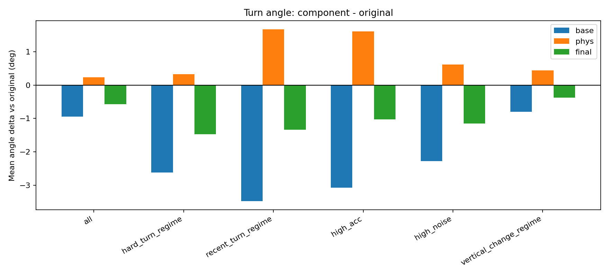

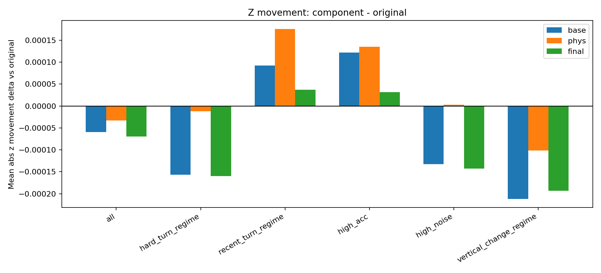

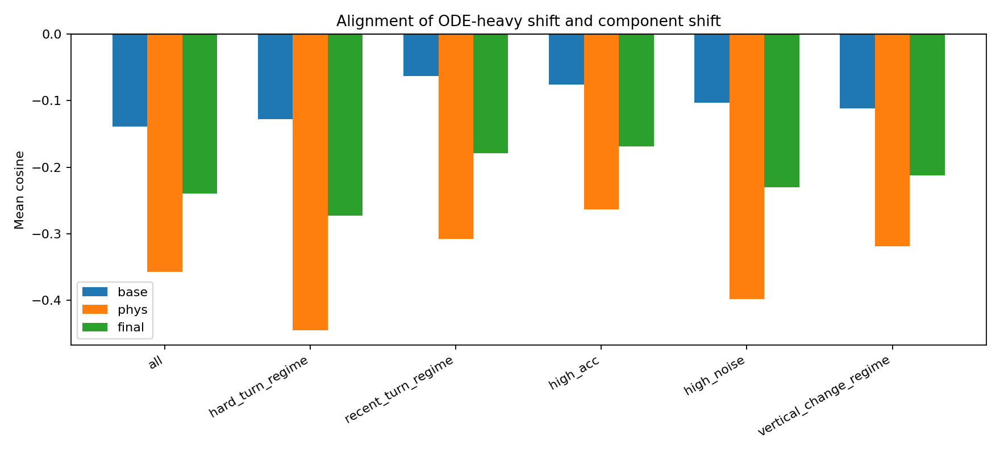

핵심은 `second_phys`다.

- second_base는 주로 덜 꺾고 z를 안정화한다.
- second_phys는 ODE-heavy와 평균 cosine이 가장 낮아, 같은 방향 보정이 아니라 다른 물리 가정을 제공한다.
- 그래서 2등 final은 단순 smoothing이 아니라, smoothing expert와 회전물리 expert가 섞인 외부 앙상블 expert다.

## 6. 50:50 비율이 합리적인 이유

비율별 행동 분석 결과, second 비율을 올릴수록 예측은 ODE-heavy에서 second_final 방향으로 이동했다.

| second 비율 | ODE-heavy에서 평균 이동 | 회전각 변화 | z 이동 변화 | CV-z에 더 가까운 비율 |
| ---: | ---: | ---: | ---: | ---: |
| 20% | 0.000335 | -0.199도 | -0.000010 | 0.6065 |
| 40% | 0.000670 | -0.368도 | -0.000018 | 0.5937 |
| 50% | 0.000838 | -0.440도 | -0.000022 | 0.5873 |
| 60% | 0.001005 | -0.502도 | -0.000026 | 0.5807 |
| 100% | 0.001675 | -0.640도 | -0.000036 | 0.5562 |

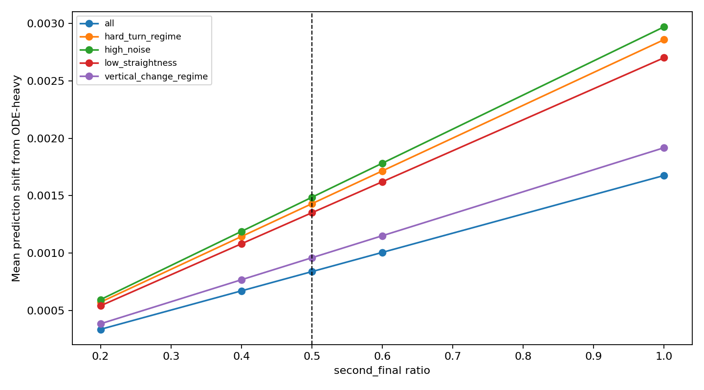

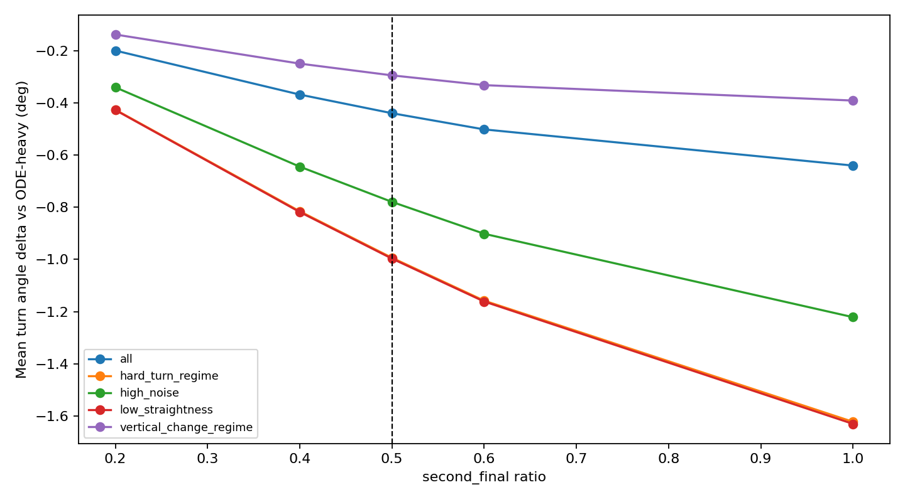

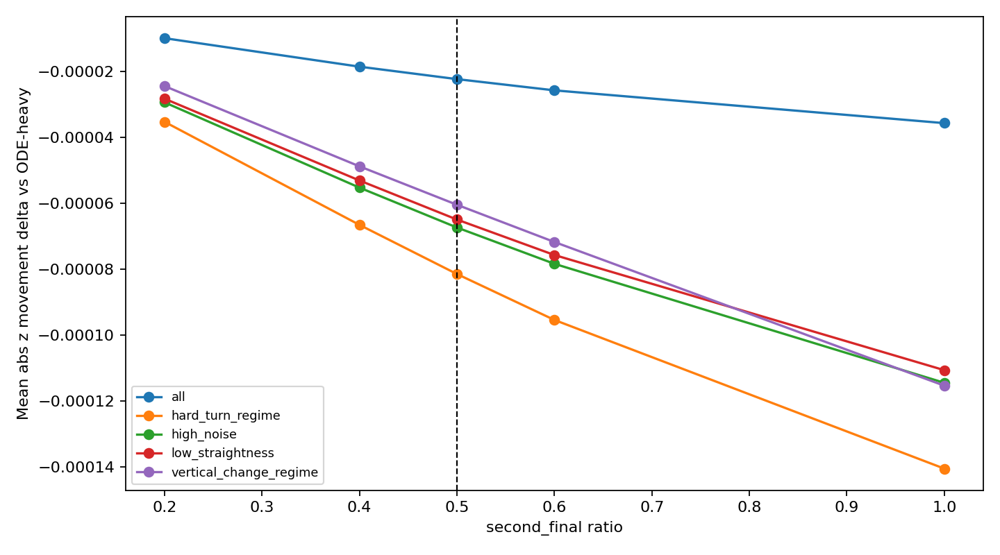

해석:

- 20%는 보정이 너무 약했다.
- 40~50%에서 GOH30의 과한 회전/동역학 반응을 충분히 누르기 시작했다.
- 60%부터는 second_final 쪽으로 너무 많이 이동해서 일부 샘플이 다시 손해를 봤다.
- 50%는 ODE-heavy의 강한 기본 예측과 2등의 보수적/물리적 보정을 가장 균형 있게 섞은 지점으로 보인다.

## 7. 샘플 궤적으로 보는 1등과 2등의 차이

아래 그림은 1등과 2등의 차이가 큰 대표 test 샘플을 최종 50:50 기준으로 다시 그린 것이다.

색상 의미:

- 검은 선: 과거 관측 궤적
- 파란 점: GOH30 원본
- 주황 점: ODE-heavy
- 초록 점: 2등 final
- 빨간 점: 최종 50:50

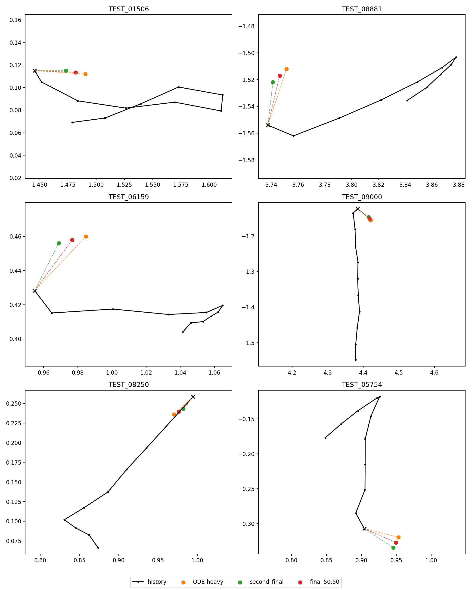

개별 샘플:

| 샘플 | 그림 | 볼 점 |
| --- | --- | --- |
| TEST_01506 | 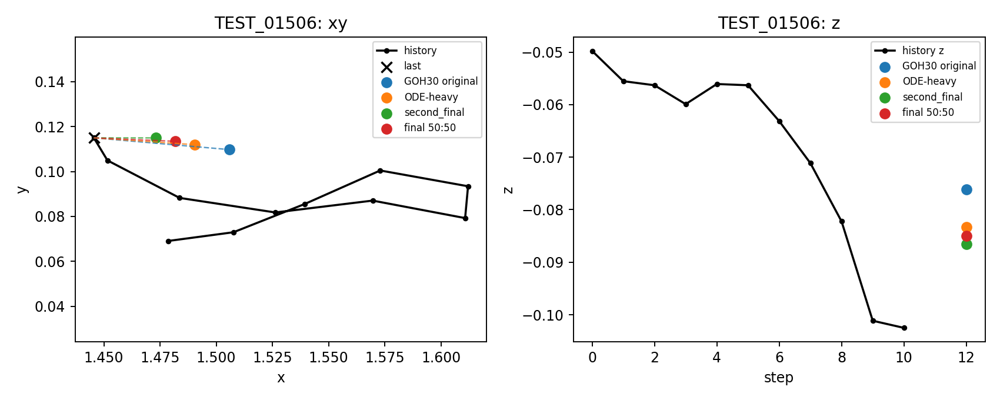 | 2등 final이 ODE-heavy와 다른 방향으로 예측을 당기는 대표 케이스 |
| TEST_08881 | 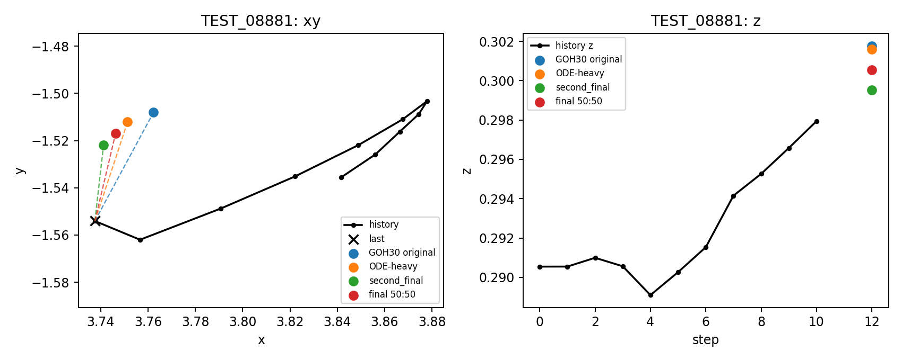 | xy 방향 차이와 z축 예측 차이를 함께 확인 |
| TEST_06159 | 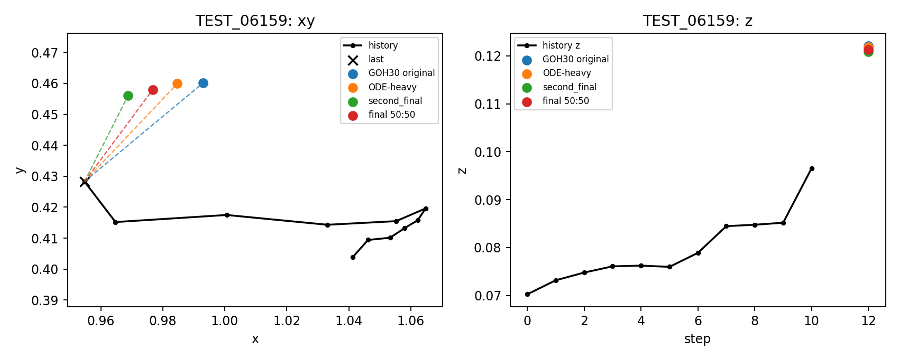 | 궤적 변화가 큰 구간에서 최종 50:50이 중간 지점으로 이동 |
| TEST_09000 | 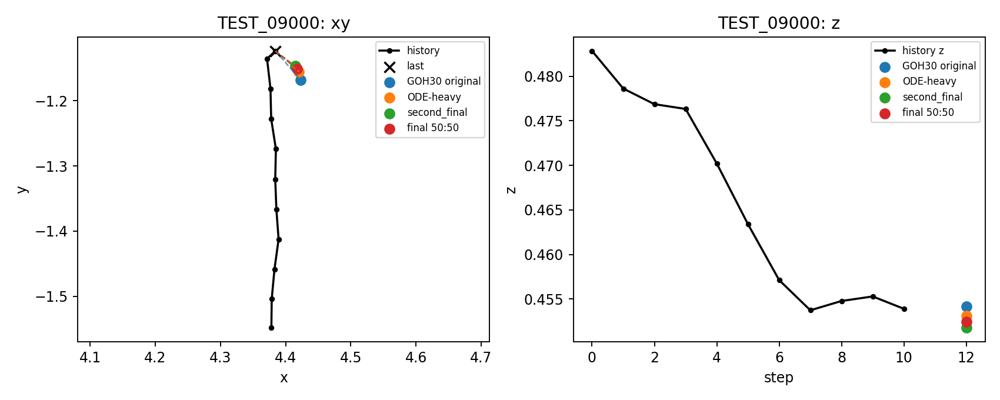 | ODE-heavy와 2등 final의 방향 차이가 뚜렷한 케이스 |
| TEST_08250 | 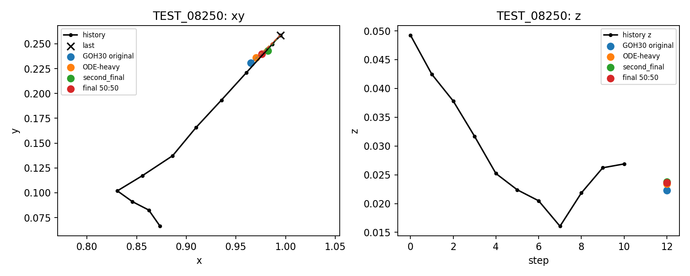 | 2등의 보수적 이동과 z 안정화 성향 확인 |
| TEST_05754 | 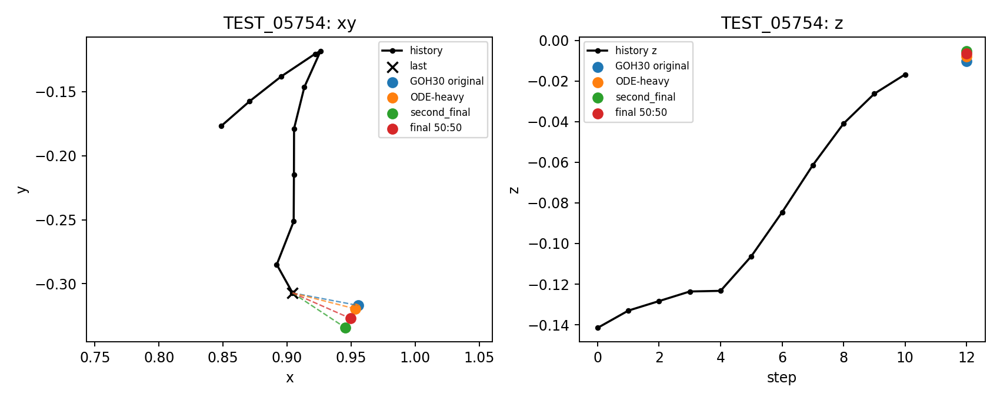 | 최종 50:50이 ODE-heavy에서 second 방향으로 충분히 이동한 케이스 |

샘플 그림에서 확인할 핵심:

- 대부분의 경우 최종 50:50은 ODE-heavy와 second_final 사이에 놓인다.
- ODE-heavy가 최근 움직임을 따라 더 적극적으로 예측하는 반면, second_final은 일부 급회전/고노이즈 구간에서 더 보수적인 위치를 제안한다.
- 20% blend는 이 차이를 약하게만 반영했지만, 50% blend는 실제 좌표를 눈에 보일 정도로 중간 지점까지 이동시킨다.
- 이 문제는 hit 경계 근처 샘플이 중요하므로, 눈으로는 작은 이동이라도 점수에는 크게 작용할 수 있다.

## 8. 실패한 실험들이 준 힌트

처음에는 PPT 아이디어와 학습 전/후처리 아이디어를 여러 방향으로 적용했다.

| 시도 | 결과 | 해석 |
| --- | --- | --- |
| 등속/Kalman 약한 베이스 + regime | 약한 베이스에서는 개선 | 단순 모델에는 궤적 구분이 유효 |
| GOH30 high_speed Kalman 후보정 | 최대 0.7022 / 0.7026 | 효과가 너무 작음 |
| regime별 ODE/GRU/H 가중치 | OOF는 개선, LB 실패 | OOF와 test 분포 차이 |
| H-heavy / KMeans MoE | OOF 0.657까지 상승, LB 0.6966로 실패 | 로컬 검증 과신 위험 |
| 학습형 stacking/gating | OOF는 개선, 제출 우선순위 낮음 | test 전이 불확실 |
| cluster feature injection / sample weighting | OOF 개선 없음 | 학습 전 피처 추가가 강한 베이스에 중복 |
| TCN expert | OOF 0.6425, LB 0.7022 / 0.7030 | 새 모델이 GOH30과 충분히 다른 오류를 못 냄 |
| Transformer-lite expert | OOF 0.6421 | TCN과 비슷해서 전체 학습 생략 |

특히 학습 전 feature injection과 sample weighting이 잘 안 된 이유:

- GOH30은 이미 local frame, 속도, 가속, 저크, 각속도, 직선성 등 강한 궤적 피처를 사용하고 있었다.
- 우리가 추가한 high_speed, high_noise, hard_turn, vertical_change 같은 regime은 모델이 이미 간접적으로 보고 있는 신호였을 가능성이 크다.
- 그래서 feature를 더 넣는 것보다, 아예 다른 inductive bias를 가진 외부 expert를 추가하는 쪽이 더 효과적이었다.

## 9. Learned MoE gating은 왜 최종 선택이 아니었나

샘플마다 2등 비율을 다르게 선택하는 learned gating도 시도했다.

```text
final_i = (1 - w_i) * ODE-heavy_i + w_i * second_i
```

OOF에서는 oracle grid가 높게 나왔다.

| 후보 | OOF hit | 평균 second weight |
| --- | ---: | ---: |
| fixed 20% | 0.6523 | 0.20 |
| fixed 40% | 0.6637 | 0.40 |
| fixed 50% | 0.6672 | 0.50 |
| fixed 60% | 0.6695 | 0.60 |
| learned HGB 계열 | 약 0.665 | 약 0.38 |
| oracle grid | 0.6812 | 약 0.38 |

해석:

- 샘플별 최적 비율이 존재할 가능성은 있다.
- 하지만 learned 모델이 fixed ratio를 확실히 이기지는 못했다.
- 더 중요한 제약은 train에서 OOF로 쓸 수 있었던 2등 expert가 `second_phys`이고, 실제 제출에서는 `second_final`을 썼다는 점이다.
- 따라서 최종 제출 기준으로는 단순하고 검증된 fixed 50%가 더 합리적이었다.

## 10. 최종 발표용 스토리라인

발표는 다음 흐름으로 정리하면 자연스럽다.

1. 1등 GOH30 원본을 재현했다.
2. GOH30 내부 비율을 바꿔보니 ODE-heavy가 private에서 더 좋았다.
3. PPT 기반 regime, clustering, sample weighting, feature injection을 적용했지만 강한 GOH30 위에서는 효과가 제한적이었다.
4. TCN/Transformer-lite처럼 새 모델 expert도 OOF에서는 좋아 보였지만 LB로 전이되지 않았다.
5. 그래서 “새로운 feature”보다 “서로 다른 오류를 내는 expert”가 필요하다고 판단했다.
6. 2등 코드를 분해해보니 `base 60% + phys 40%`였고, GOH30과 다른 궤적 성향을 보였다.
7. 특히 2등은 급회전/고노이즈/z 변화 구간에서 덜 꺾거나 안정화하는 경향이 있었고, phys는 ODE-heavy와 다른 방향의 물리 보정을 제공했다.
8. 2등 final 비율을 올려보니 50%에서 최고 점수가 나왔다.
9. 2등 내부 phys 비율을 줄이면 성능이 떨어져, 회전물리 expert가 실제로 중요했음을 확인했다.
10. 최종적으로 `1등 GRU 10% + 1등 ODE/RK 30% + 1등 H 10% + 2등 base 30% + 2등 phys 20%` 구조가 가장 타당한 결론이다.

## 11. 발표 장표에 넣으면 좋은 그림

필수:

- `submission_score_progression.png`: 전체 점수 흐름
- `final_expanded_composition.png`: 최종 5개 expert 비율
- `second_ratio_score_curve.png`: 왜 50%인지
- `trajectory_case_contact_sheet_final50.png`: 실제 궤적 샘플에서 최종 50:50이 어디로 이동했는지
- `component_turn_angle_delta_by_regime.png`: 2등이 어떤 구간에서 덜 꺾는지
- `component_ode_alignment_by_regime.png`: 2등 phys가 왜 다른 expert인지

보조:

- `ratio_shift_from_ode.png`: 20/40/50/60%가 실제로 얼마나 움직였는지
- `ratio_z_delta_vs_ode.png`: z 안정화 효과
- `candidate_turn_delta_vs_fixed50.png`: 50% 주변 fine blend 비교
- `candidate_z_delta_vs_fixed50.png`: 2등 내부 base/phys 조절 비교

## 12. 최종 한 줄 결론

> GOH30 내부 feature나 학습 전 보정은 이미 1등 코드가 많은 신호를 사용하고 있어 개선 폭이 작았고, 실제 개선은 GOH30과 다른 오류 구조를 가진 2등 `base + 회전물리` 외부 전문가를 50%까지 섞으면서 나왔다. 최종 비율은 제출 결과와 궤적 분석 모두에서 `1등 ODE-heavy 50% + 2등 base 30% + 2등 phys 20%`가 가장 균형 잡힌 선택으로 확인됐다.
